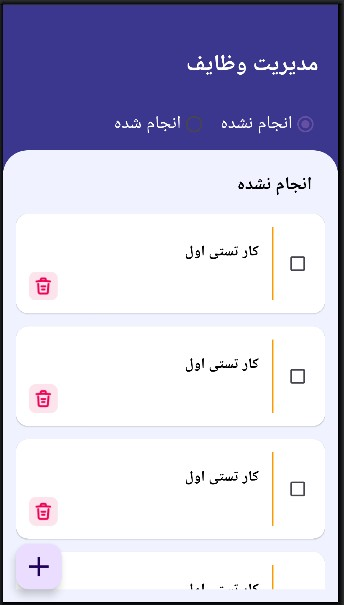
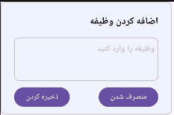

# اپلیکیشن مدیریت وظایف 

اپلیکیشن اموزشی ساده برای مدیریت وظایف که با معماری mvp نوشته شده.  

- مدیریت وظایف  ( ذخیره کردن هر وظیفه در پایگاه داده و مدیریت ان)
  
.

## عملکرد برنامه
- عملیات اصلی : (عملیات اضافه کردن یک وظیفه  ، حذف کردن  و انتقال وظیفه به لیست انجام شده ها)
   

## تکنولوژی‌های استفاده شده
- زبان: **Kotlin**
- معماری MVP
- کتابخانه های  Room - RecyclerView - constraintlayout -  livedata -
- بخش Ui با Xml 

- محیط توسعه: **Android Studio**
 minSdk = 24
targetSdk = 34

<table style="width:100%">
  <tr>
    <td></td> 
    <td></td> 
  </tr>
  

